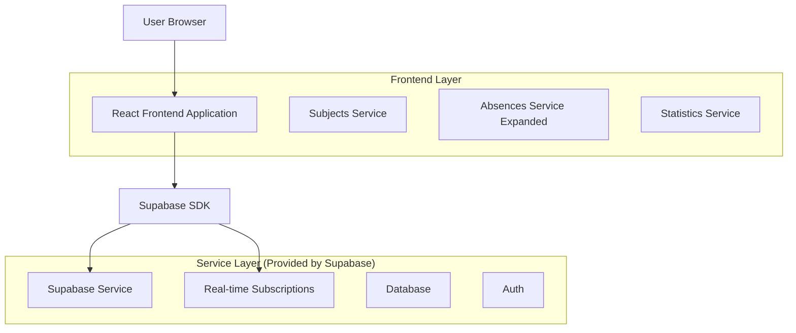
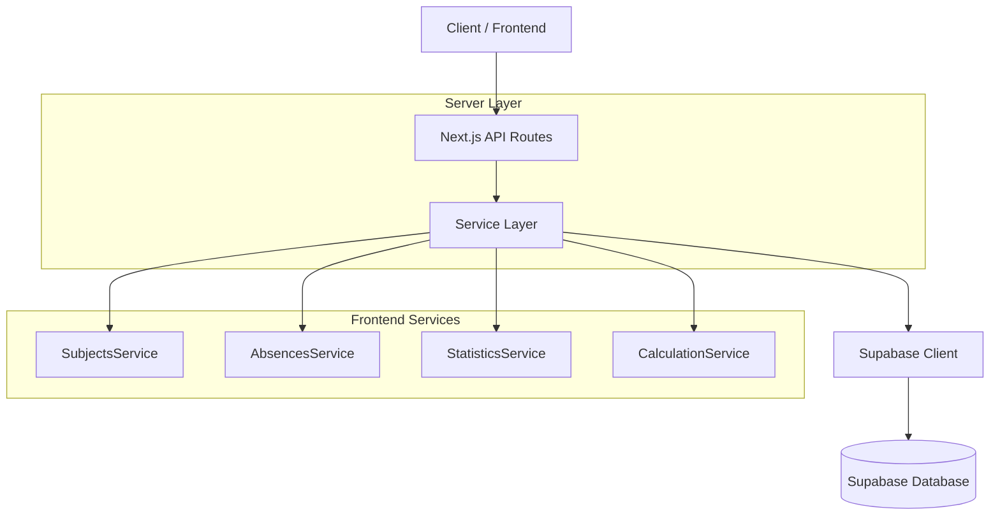
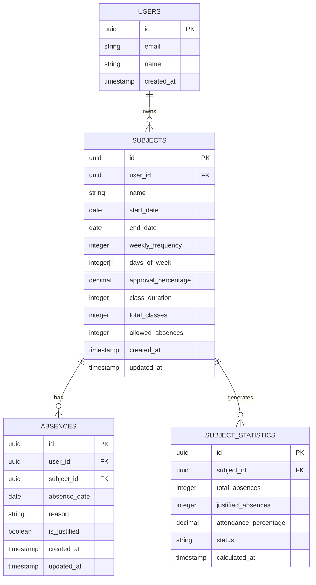

## 1. Architecture design



## 2. Technology Description

* Frontend: React\@18 + Next.js\@14 + TailwindCSS\@3 + TypeScript\@5

* Backend: Supabase (PostgreSQL + Auth + Real-time)

* Charts: Recharts\@2 para visualização de dados

* Date handling: date-fns\@2 para cálculos de período

* Icons: Lucide React para interface

## 3. Route definitions

| Route              | Purpose                                       |
| ------------------ | --------------------------------------------- |
| /faltas            | Dashboard principal de faltas com visão geral |
| /faltas/materias   | Configuração e gerenciamento de matérias      |
| /faltas/registro   | Interface para registrar novas faltas         |
| /faltas/relatorios | Relatórios e estatísticas detalhadas          |

## 4. API definitions

### 4.1 Core API

Gerenciamento de Matérias

```
POST /api/subjects
```

Request:

| Param Name           | Param Type | isRequired | Description                               |
| -------------------- | ---------- | ---------- | ----------------------------------------- |
| name                 | string     | true       | Nome da matéria                           |
| start\_date          | string     | true       | Data de início das aulas (ISO)            |
| end\_date            | string     | true       | Data de término das aulas (ISO)           |
| weekly\_frequency    | number     | true       | Quantas vezes por semana (1-7)            |
| days\_of\_week       | number\[]  | true       | Dias da semana \[0-6] (0=domingo)         |
| approval\_percentage | number     | true       | Porcentagem mínima para aprovação (0-100) |
| class\_duration      | number     | false      | Duração da aula em minutos (padrão: 60)   |

Response:

| Param Name        | Param Type | Description                  |
| ----------------- | ---------- | ---------------------------- |
| id                | string     | ID único da matéria          |
| total\_classes    | number     | Total de aulas calculado     |
| allowed\_absences | number     | Faltas permitidas calculadas |
| created\_at       | string     | Data de criação              |

```
GET /api/subjects
```

Response:

| Param Name | Param Type | Description                  |
| ---------- | ---------- | ---------------------------- |
| subjects   | Subject\[] | Lista de matérias do usuário |
| statistics | object     | Estatísticas gerais          |

Registro de Faltas Expandido

```
POST /api/absences
```

Request:

| Param Name    | Param Type | isRequired | Description              |
| ------------- | ---------- | ---------- | ------------------------ |
| subject\_id   | string     | true       | ID da matéria            |
| absence\_date | string     | true       | Data da falta (ISO)      |
| reason        | string     | false      | Motivo da falta          |
| is\_justified | boolean    | false      | Se a falta é justificada |

Estatísticas e Relatórios

```
GET /api/absences/statistics
```

Response:

| Param Name      | Param Type | Description              |
| --------------- | ---------- | ------------------------ |
| by\_subject     | object\[]  | Estatísticas por matéria |
| weekly\_summary | object     | Resumo semanal           |
| risk\_subjects  | string\[]  | Matérias em risco        |

## 5. Server architecture diagram



## 6. Data model

### 6.1 Data model definition



### 6.2 Data Definition Language

Tabela de Matérias (subjects)

```sql
-- create table
CREATE TABLE subjects (
    id UUID PRIMARY KEY DEFAULT gen_random_uuid(),
    user_id UUID NOT NULL REFERENCES auth.users(id) ON DELETE CASCADE,
    name VARCHAR(255) NOT NULL,
    start_date DATE NOT NULL,
    end_date DATE NOT NULL,
    weekly_frequency INTEGER NOT NULL CHECK (weekly_frequency >= 1 AND weekly_frequency <= 7),
    days_of_week INTEGER[] NOT NULL,
    approval_percentage DECIMAL(5,2) NOT NULL CHECK (approval_percentage > 0 AND approval_percentage <= 100),
    class_duration INTEGER DEFAULT 60,
    total_classes INTEGER GENERATED ALWAYS AS (
        CASE 
            WHEN start_date IS NOT NULL AND end_date IS NOT NULL AND weekly_frequency IS NOT NULL 
            THEN weekly_frequency * EXTRACT(WEEK FROM (end_date - start_date))
            ELSE 0
        END
    ) STORED,
    allowed_absences INTEGER GENERATED ALWAYS AS (
        CASE 
            WHEN total_classes > 0 AND approval_percentage IS NOT NULL
            THEN FLOOR(total_classes * (100 - approval_percentage) / 100)
            ELSE 0
        END
    ) STORED,
    created_at TIMESTAMP WITH TIME ZONE DEFAULT NOW(),
    updated_at TIMESTAMP WITH TIME ZONE DEFAULT NOW()
);

-- create indexes
CREATE INDEX idx_subjects_user_id ON subjects(user_id);
CREATE INDEX idx_subjects_start_date ON subjects(start_date);
CREATE INDEX idx_subjects_end_date ON subjects(end_date);

-- RLS policies
ALTER TABLE subjects ENABLE ROW LEVEL SECURITY;
CREATE POLICY "Users can view own subjects" ON subjects FOR SELECT USING (auth.uid() = user_id);
CREATE POLICY "Users can insert own subjects" ON subjects FOR INSERT WITH CHECK (auth.uid() = user_id);
CREATE POLICY "Users can update own subjects" ON subjects FOR UPDATE USING (auth.uid() = user_id);
CREATE POLICY "Users can delete own subjects" ON subjects FOR DELETE USING (auth.uid() = user_id);

-- Grant permissions
GRANT SELECT ON subjects TO anon;
GRANT ALL PRIVILEGES ON subjects TO authenticated;
```

Tabela de Estatísticas (subject\_statistics)

```sql
-- create table
CREATE TABLE subject_statistics (
    id UUID PRIMARY KEY DEFAULT gen_random_uuid(),
    subject_id UUID NOT NULL REFERENCES subjects(id) ON DELETE CASCADE,
    total_absences INTEGER DEFAULT 0,
    justified_absences INTEGER DEFAULT 0,
    attendance_percentage DECIMAL(5,2) GENERATED ALWAYS AS (
        CASE 
            WHEN (SELECT total_classes FROM subjects WHERE id = subject_id) > 0
            THEN ((SELECT total_classes FROM subjects WHERE id = subject_id) - total_absences) * 100.0 / (SELECT total_classes FROM subjects WHERE id = subject_id)
            ELSE 100.0
        END
    ) STORED,
    status VARCHAR(20) GENERATED ALWAYS AS (
        CASE 
            WHEN attendance_percentage >= (SELECT approval_percentage FROM subjects WHERE id = subject_id) THEN 'safe'
            WHEN attendance_percentage >= (SELECT approval_percentage FROM subjects WHERE id = subject_id) - 10 THEN 'warning'
            ELSE 'danger'
        END
    ) STORED,
    calculated_at TIMESTAMP WITH TIME ZONE DEFAULT NOW()
);

-- create indexes
CREATE INDEX idx_subject_statistics_subject_id ON subject_statistics(subject_id);
CREATE INDEX idx_subject_statistics_status ON subject_statistics(status);

-- RLS policies
ALTER TABLE subject_statistics ENABLE ROW LEVEL SECURITY;
CREATE POLICY "Users can view own subject statistics" ON subject_statistics FOR SELECT 
USING (EXISTS (SELECT 1 FROM subjects WHERE subjects.id = subject_statistics.subject_id AND subjects.user_id = auth.uid()));

-- Grant permissions
GRANT SELECT ON subject_statistics TO anon;
GRANT ALL PRIVILEGES ON subject_statistics TO authenticated;
```

Atualização da tabela de faltas existente

```sql
-- add new columns to existing absences table
ALTER TABLE absences ADD COLUMN IF NOT EXISTS subject_id UUID REFERENCES subjects(id) ON DELETE CASCADE;
ALTER TABLE absences ADD COLUMN IF NOT EXISTS is_justified BOOLEAN DEFAULT false;
ALTER TABLE absences ADD COLUMN IF NOT EXISTS reason TEXT;

-- create new indexes
CREATE INDEX IF NOT EXISTS idx_absences_subject_id ON absences(subject_id);
CREATE INDEX IF NOT EXISTS idx_absences_date ON absences(absence_date);
CREATE INDEX IF NOT EXISTS idx_absences_justified ON absences(is_justified);

-- update RLS policies
DROP POLICY IF EXISTS "Users can view own absences" ON absences;
CREATE POLICY "Users can view own absences" ON absences FOR SELECT 
USING (auth.uid() = user_id OR EXISTS (SELECT 1 FROM subjects WHERE subjects.id = absences.subject_id AND subjects.user_id = auth.uid()));
```

Função para atualizar estatísticas automaticamente

```sql
-- function to update statistics
CREATE OR REPLACE FUNCTION update_subject_statistics()
RETURNS TRIGGER AS $$
BEGIN
    INSERT INTO subject_statistics (subject_id, total_absences, justified_absences)
    SELECT 
        NEW.subject_id,
        COUNT(*),
        COUNT(*) FILTER (WHERE is_justified = true)
    FROM absences 
    WHERE subject_id = NEW.subject_id
    ON CONFLICT (subject_id) DO UPDATE SET
        total_absences = EXCLUDED.total_absences,
        justified_absences = EXCLUDED.justified_absences,
        calculated_at = NOW();
    
    RETURN NEW;
END;
$$ LANGUAGE plpgsql;

-- trigger to auto-update statistics
CREATE TRIGGER trigger_update_subject_statistics
    AFTER INSERT OR UPDATE OR DELETE ON absences
    FOR EACH ROW
    EXECUTE FUNCTION update_subject_statistics();
```

