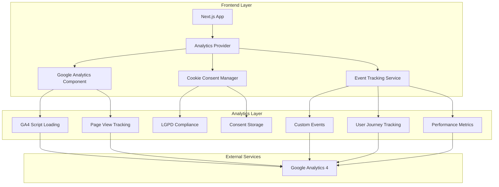

# Arquitetura Técnica - Google Analytics 4 Implementation

## 1. Arquitetura Geral



## 2. Stack Tecnológico

- **Frontend**: Next.js 14 + TypeScript + TailwindCSS
- **Analytics**: Google Analytics 4 (GA4)
- **Consent Management**: Custom LGPD/GDPR solution
- **State Management**: React Context + Local Storage
- **Event Tracking**: Custom hooks + GA4 Events API

## 3. Estrutura de Arquivos

```
src/
├── components/
│   └── analytics/
│       ├── google-analytics.tsx
│       ├── cookie-consent.tsx
│       └── analytics-provider.tsx
├── hooks/
│   ├── use-analytics.ts
│   └── use-consent.ts
├── lib/
│   └── analytics/
│       ├── google-analytics.ts
│       ├── events.ts
│       └── consent.ts
├── types/
│   └── analytics.ts
└── app/
    ├── layout.tsx (GA integration)
    └── privacidade/
        └── page.tsx
```

## 4. Definições de Tipos

**Arquivo: `src/types/analytics.ts`**

```typescript
// Tipos base para eventos
export interface BaseAnalyticsEvent {
  action: string;
  category: string;
  label?: string;
  value?: number;
  custom_parameters?: Record<string, any>;
}

// Eventos de autenticação
export interface AuthEvent extends BaseAnalyticsEvent {
  category: 'authentication';
  action: 'login' | 'sign_up' | 'logout';
  label: 'email' | 'google';
}

// Eventos de estudo
export interface StudyEvent extends BaseAnalyticsEvent {
  category: 'study';
  action: 'study_session_start' | 'study_session_complete' | 'pomodoro_complete';
  label: string; // subject name
  value?: number; // duration in minutes
}

// Eventos de simulados
export interface SimulationEvent extends BaseAnalyticsEvent {
  category: 'simulation';
  action: 'simulation_start' | 'simulation_complete' | 'question_answered';
  label: string; // simulation name
  value?: number; // score or question number
  custom_parameters?: {
    simulation_id?: string;
    duration?: number;
    correct?: boolean;
  };
}

// Eventos de flashcards
export interface FlashcardEvent extends BaseAnalyticsEvent {
  category: 'flashcards';
  action: 'flashcard_created' | 'flashcard_studied' | 'deck_completed';
  label: string; // deck name
  custom_parameters?: {
    deck_id?: string;
    correct?: boolean;
    difficulty?: 'easy' | 'medium' | 'hard';
  };
}

// Eventos de gamificação
export interface GamificationEvent extends BaseAnalyticsEvent {
  category: 'gamification';
  action: 'xp_gained' | 'achievement_unlocked' | 'level_up';
  label: string; // event type or achievement name
  value?: number; // XP amount or new level
  custom_parameters?: {
    achievement_id?: string;
    old_level?: number;
    new_level?: number;
  };
}

// Eventos de navegação
export interface NavigationEvent extends BaseAnalyticsEvent {
  category: 'navigation';
  action: 'page_visit' | 'feature_click' | 'menu_interaction';
  label: string; // page name or feature name
  custom_parameters?: {
    section?: string;
    previous_page?: string;
  };
}

// União de todos os tipos de eventos
export type AnalyticsEvent = 
  | AuthEvent 
  | StudyEvent 
  | SimulationEvent 
  | FlashcardEvent 
  | GamificationEvent 
  | NavigationEvent;

// Configuração de consentimento
export interface ConsentSettings {
  analytics: boolean;
  marketing: boolean;
  functional: boolean;
  timestamp: number;
}

// Configuração do GA4
export interface GA4Config {
  measurementId: string;
  enabled: boolean;
  debugMode: boolean;
  consentMode: {
    analytics_storage: 'granted' | 'denied';
    ad_storage: 'granted' | 'denied';
  };
}
```

## 5. Serviço de Eventos

**Arquivo: `src/lib/analytics/events.ts`**

```typescript
import { AnalyticsEvent } from '@/types/analytics';
import { trackEvent } from './google-analytics';

// Classe para gerenciar eventos de analytics
export class AnalyticsEventService {
  private static instance: AnalyticsEventService;
  private eventQueue: AnalyticsEvent[] = [];
  private isOnline = true;

  private constructor() {
    // Monitorar status de conexão
    if (typeof window !== 'undefined') {
      window.addEventListener('online', () => {
        this.isOnline = true;
        this.flushEventQueue();
      });
      
      window.addEventListener('offline', () => {
        this.isOnline = false;
      });
    }
  }

  public static getInstance(): AnalyticsEventService {
    if (!AnalyticsEventService.instance) {
      AnalyticsEventService.instance = new AnalyticsEventService();
    }
    return AnalyticsEventService.instance;
  }

  // Enviar evento
  public track(event: AnalyticsEvent): void {
    if (!this.isOnline) {
      this.eventQueue.push(event);
      return;
    }

    try {
      trackEvent(event);
      this.logEvent(event);
    } catch (error) {
      console.error('Erro ao enviar evento de analytics:', error);
      this.eventQueue.push(event);
    }
  }

  // Enviar eventos em lote
  public trackBatch(events: AnalyticsEvent[]): void {
    events.forEach(event => this.track(event));
  }

  // Processar fila de eventos offline
  private flushEventQueue(): void {
    if (this.eventQueue.length === 0) return;

    const eventsToSend = [...this.eventQueue];
    this.eventQueue = [];

    eventsToSend.forEach(event => this.track(event));
  }

  // Log de eventos para debug
  private logEvent(event: AnalyticsEvent): void {
    if (process.env.NODE_ENV === 'development') {
      console.log('📊 Analytics Event:', {
        action: event.action,
        category: event.category,
        label: event.label,
        value: event.value,
        custom_parameters: event.custom_parameters,
      });
    }
  }

  // Limpar fila de eventos
  public clearEventQueue(): void {
    this.eventQueue = [];
  }

  // Obter estatísticas da fila
  public getQueueStats(): { queueSize: number; isOnline: boolean } {
    return {
      queueSize: this.eventQueue.length,
      isOnline: this.isOnline,
    };
  }
}

// Instância singleton
export const analyticsEventService = AnalyticsEventService.getInstance();

// Funções de conveniência para eventos específicos
export const trackAuthEvent = (action: 'login' | 'sign_up' | 'logout', method: 'email' | 'google') => {
  analyticsEventService.track({
    action,
    category: 'authentication',
    label: method,
  });
};

export const trackStudyEvent = (
  action: 'study_session_start' | 'study_session_complete',
  subject: string,
  duration?: number
) => {
  analyticsEventService.track({
    action,
    category: 'study',
    label: subject,
    value: duration,
  });
};

export const trackSimulationEvent = (
  action: 'simulation_start' | 'simulation_complete',
  simulationName: string,
  options?: {
    simulationId?: string;
    score?: number;
    duration?: number;
  }
) => {
  analyticsEventService.track({
    action,
    category: 'simulation',
    label: simulationName,
    value: options?.score,
    custom_parameters: {
      simulation_id: options?.simulationId,
      duration: options?.duration,
    },
  });
};

export const trackGamificationEvent = (
  action: 'xp_gained' | 'achievement_unlocked' | 'level_up',
  label: string,
  value?: number,
  customParams?: Record<string, any>
) => {
  analyticsEventService.track({
    action,
    category: 'gamification',
    label,
    value,
    custom_parameters: customParams,
  });
};
```

## 6. Gerenciamento de Consentimento

**Arquivo: `src/lib/analytics/consent.ts`**

```typescript
import { ConsentSettings } from '@/types/analytics';

const CONSENT_STORAGE_KEY = 'medjourney-consent-settings';
const CONSENT_VERSION = '1.0';

export class ConsentManager {
  private static instance: ConsentManager;
  private settings: ConsentSettings | null = null;
  private listeners: Array<(settings: ConsentSettings) => void> = [];

  private constructor() {
    this.loadSettings();
  }

  public static getInstance(): ConsentManager {
    if (!ConsentManager.instance) {
      ConsentManager.instance = new ConsentManager();
    }
    return ConsentManager.instance;
  }

  // Carregar configurações do localStorage
  private loadSettings(): void {
    if (typeof window === 'undefined') return;

    try {
      const stored = localStorage.getItem(CONSENT_STORAGE_KEY);
      if (stored) {
        const parsed = JSON.parse(stored);
        if (parsed.version === CONSENT_VERSION) {
          this.settings = parsed.settings;
        }
      }
    } catch (error) {
      console.error('Erro ao carregar configurações de consentimento:', error);
    }
  }

  // Salvar configurações no localStorage
  private saveSettings(): void {
    if (typeof window === 'undefined' || !this.settings) return;

    try {
      const toStore = {
        version: CONSENT_VERSION,
        settings: this.settings,
      };
      localStorage.setItem(CONSENT_STORAGE_KEY, JSON.stringify(toStore));
    } catch (error) {
      console.error('Erro ao salvar configurações de consentimento:', error);
    }
  }

  // Obter configurações atuais
  public getSettings(): ConsentSettings | null {
    return this.settings;
  }

  // Verificar se o consentimento foi dado
  public hasConsent(): boolean {
    return this.settings !== null;
  }

  // Verificar consentimento para analytics
  public hasAnalyticsConsent(): boolean {
    return this.settings?.analytics === true;
  }

  // Atualizar configurações de consentimento
  public updateSettings(newSettings: Partial<ConsentSettings>): void {
    this.settings = {
      analytics: false,
      marketing: false,
      functional: true, // Sempre permitido para funcionalidade básica
      timestamp: Date.now(),
      ...this.settings,
      ...newSettings,
    };

    this.saveSettings();
    this.notifyListeners();
    this.updateGAConsent();
  }

  // Aceitar todos os consentimentos
  public acceptAll(): void {
    this.updateSettings({
      analytics: true,
      marketing: false, // Manter false por enquanto
      functional: true,
    });
  }

  // Recusar consentimentos opcionais
  public declineAll(): void {
    this.updateSettings({
      analytics: false,
      marketing: false,
      functional: true,
    });
  }

  // Resetar configurações
  public reset(): void {
    this.settings = null;
    if (typeof window !== 'undefined') {
      localStorage.removeItem(CONSENT_STORAGE_KEY);
    }
    this.notifyListeners();
  }

  // Adicionar listener para mudanças
  public addListener(callback: (settings: ConsentSettings) => void): void {
    this.listeners.push(callback);
  }

  // Remover listener
  public removeListener(callback: (settings: ConsentSettings) => void): void {
    this.listeners = this.listeners.filter(listener => listener !== callback);
  }

  // Notificar listeners sobre mudanças
  private notifyListeners(): void {
    if (this.settings) {
      this.listeners.forEach(callback => callback(this.settings!));
    }
  }

  // Atualizar consentimento no GA4
  private updateGAConsent(): void {
    if (typeof window === 'undefined' || !window.gtag) return;

    window.gtag('consent', 'update', {
      analytics_storage: this.settings?.analytics ? 'granted' : 'denied',
      ad_storage: this.settings?.marketing ? 'granted' : 'denied',
    });
  }

  // Verificar se precisa mostrar banner de consentimento
  public shouldShowConsentBanner(): boolean {
    return !this.hasConsent();
  }

  // Obter tempo desde o último consentimento
  public getConsentAge(): number | null {
    if (!this.settings?.timestamp) return null;
    return Date.now() - this.settings.timestamp;
  }

  // Verificar se o consentimento expirou (1 ano)
  public isConsentExpired(): boolean {
    const age = this.getConsentAge();
    if (age === null) return true;
    return age > 365 * 24 * 60 * 60 * 1000; // 1 ano em ms
  }
}

// Instância singleton
export const consentManager = ConsentManager.getInstance();

// Hook para usar o gerenciador de consentimento
export const useConsent = () => {
  const [settings, setSettings] = useState<ConsentSettings | null>(
    consentManager.getSettings()
  );

  useEffect(() => {
    const handleSettingsChange = (newSettings: ConsentSettings) => {
      setSettings(newSettings);
    };

    consentManager.addListener(handleSettingsChange);

    return () => {
      consentManager.removeListener(handleSettingsChange);
    };
  }, []);

  return {
    settings,
    hasConsent: consentManager.hasConsent(),
    hasAnalyticsConsent: consentManager.hasAnalyticsConsent(),
    shouldShowBanner: consentManager.shouldShowConsentBanner(),
    acceptAll: () => consentManager.acceptAll(),
    declineAll: () => consentManager.declineAll(),
    updateSettings: (newSettings: Partial<ConsentSettings>) => 
      consentManager.updateSettings(newSettings),
    reset: () => consentManager.reset(),
  };
};
```

## 7. Provider de Analytics

**Arquivo: `src/components/analytics/analytics-provider.tsx`**

```typescript
'use client';

import React, { createContext, useContext, useEffect, useState } from 'react';
import { ConsentSettings } from '@/types/analytics';
import { consentManager } from '@/lib/analytics/consent';
import { initGA } from '@/lib/analytics/google-analytics';
import GoogleAnalytics from './google-analytics';
import CookieConsent from './cookie-consent';

interface AnalyticsContextType {
  isInitialized: boolean;
  hasConsent: boolean;
  settings: ConsentSettings | null;
}

const AnalyticsContext = createContext<AnalyticsContextType | undefined>(undefined);

export const useAnalyticsContext = () => {
  const context = useContext(AnalyticsContext);
  if (context === undefined) {
    throw new Error('useAnalyticsContext must be used within an AnalyticsProvider');
  }
  return context;
};

interface AnalyticsProviderProps {
  children: React.ReactNode;
}

export default function AnalyticsProvider({ children }: AnalyticsProviderProps) {
  const [isInitialized, setIsInitialized] = useState(false);
  const [hasConsent, setHasConsent] = useState(false);
  const [settings, setSettings] = useState<ConsentSettings | null>(null);

  useEffect(() => {
    // Carregar configurações iniciais
    const currentSettings = consentManager.getSettings();
    setSettings(currentSettings);
    setHasConsent(consentManager.hasAnalyticsConsent());

    // Listener para mudanças de consentimento
    const handleConsentChange = (newSettings: ConsentSettings) => {
      setSettings(newSettings);
      setHasConsent(newSettings.analytics);
      
      if (newSettings.analytics && !isInitialized) {
        initGA();
        setIsInitialized(true);
      }
    };

    consentManager.addListener(handleConsentChange);

    // Inicializar GA se já tiver consentimento
    if (consentManager.hasAnalyticsConsent()) {
      initGA();
      setIsInitialized(true);
    }

    return () => {
      consentManager.removeListener(handleConsentChange);
    };
  }, [isInitialized]);

  const contextValue: AnalyticsContextType = {
    isInitialized,
    hasConsent,
    settings,
  };

  return (
    <AnalyticsContext.Provider value={contextValue}>
      <GoogleAnalytics />
      <CookieConsent />
      {children}
    </AnalyticsContext.Provider>
  );
}
```

## 8. Integração com Layout Principal

**Modificação no arquivo: `src/app/layout.tsx`**

```typescript
import AnalyticsProvider from '@/components/analytics/analytics-provider';

export default function RootLayout({
  children,
}: {
  children: React.ReactNode;
}) {
  return (
    <html lang="pt-BR">
      <body>
        <AnalyticsProvider>
          {children}
        </AnalyticsProvider>
      </body>
    </html>
  );
}
```

## 9. Configuração de Desenvolvimento

**Arquivo: `src/lib/analytics/config.ts`**

```typescript
import { GA4Config } from '@/types/analytics';

// Configuração do GA4 baseada no ambiente
export const getGA4Config = (): GA4Config => {
  const measurementId = process.env.NEXT_PUBLIC_GA_MEASUREMENT_ID;
  const environment = process.env.NEXT_PUBLIC_ENVIRONMENT;
  const isDevelopment = process.env.NODE_ENV === 'development';

  return {
    measurementId: measurementId || '',
    enabled: !!(measurementId && environment === 'production'),
    debugMode: isDevelopment,
    consentMode: {
      analytics_storage: 'denied', // Padrão negado até consentimento
      ad_storage: 'denied',
    },
  };
};

// Verificar se GA está habilitado
export const isGAEnabled = (): boolean => {
  const config = getGA4Config();
  return config.enabled && typeof window !== 'undefined';
};

// Configurações de debug
export const DEBUG_CONFIG = {
  logEvents: process.env.NODE_ENV === 'development',
  showConsentBanner: true,
  enableOfflineQueue: true,
};
```

## 10. Testes e Validação

**Arquivo: `src/lib/analytics/__tests__/analytics.test.ts`**

```typescript
import { analyticsEventService } from '../events';
import { consentManager } from '../consent';

// Mock do gtag
declare global {
  interface Window {
    gtag: jest.Mock;
  }
}

beforeEach(() => {
  window.gtag = jest.fn();
  consentManager.reset();
});

describe('Analytics Event Service', () => {
  test('deve enfileirar eventos quando offline', () => {
    // Simular offline
    Object.defineProperty(navigator, 'onLine', {
      writable: true,
      value: false,
    });

    analyticsEventService.track({
      action: 'test_event',
      category: 'test',
    });

    const stats = analyticsEventService.getQueueStats();
    expect(stats.queueSize).toBe(1);
    expect(stats.isOnline).toBe(false);
  });

  test('deve enviar eventos quando online', () => {
    consentManager.acceptAll();
    
    analyticsEventService.track({
      action: 'test_event',
      category: 'test',
      label: 'test_label',
    });

    expect(window.gtag).toHaveBeenCalledWith('event', 'test_event', {
      event_category: 'test',
      event_label: 'test_label',
    });
  });
});

describe('Consent Manager', () => {
  test('deve salvar e carregar configurações', () => {
    consentManager.updateSettings({
      analytics: true,
      marketing: false,
    });

    expect(consentManager.hasAnalyticsConsent()).toBe(true);
    expect(consentManager.getSettings()?.marketing).toBe(false);
  });

  test('deve mostrar banner quando não há consentimento', () => {
    expect(consentManager.shouldShowConsentBanner()).toBe(true);
    
    consentManager.acceptAll();
    expect(consentManager.shouldShowConsentBanner()).toBe(false);
  });
});
```

Esta arquitetura técnica fornece uma base robusta e escalável para implementação do Google Analytics 4 no MedJourney, com foco em performance, privacidade e manutenibilidade.