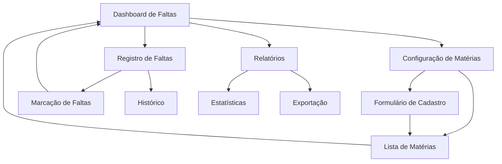

## 1. Product Overview
Sistema expandido de controle de faltas acadêmicas que permite configurar matérias com parâmetros específicos (período letivo, frequência semanal, porcentagem mínima) e calcular automaticamente as faltas permitidas, oferecendo um dashboard completo para acompanhamento da frequência.

O sistema resolve o problema de controle manual de faltas, permitindo que estudantes monitorem sua frequência de forma automatizada e visual, evitando reprovações por falta.

## 2. Core Features

### 2.1 User Roles
| Role | Registration Method | Core Permissions |
|------|---------------------|------------------|
| Estudante | Login existente na plataforma | Pode configurar matérias, registrar faltas e visualizar estatísticas |

### 2.2 Feature Module
Nosso sistema de controle de faltas expandido consiste nas seguintes páginas principais:
1. **Dashboard de Faltas**: visão geral das matérias, status de frequência, alertas de risco.
2. **Configuração de Matérias**: cadastro de matérias com parâmetros acadêmicos, edição e exclusão.
3. **Registro de Faltas**: interface para marcar faltas individuais, histórico de faltas.
4. **Relatórios**: estatísticas detalhadas, exportação de dados, análise de tendências.

### 2.3 Page Details
| Page Name | Module Name | Feature description |
|-----------|-------------|---------------------|
| Dashboard de Faltas | Visão Geral | Exibir cards com status de cada matéria (verde/amarelo/vermelho), mostrar faltas usadas vs permitidas, alertas de risco de reprovação |
| Dashboard de Faltas | Resumo Semanal | Mostrar faltas da semana atual, próximas aulas, lembretes de frequência |
| Configuração de Matérias | Formulário de Cadastro | Criar matéria com nome, data início/fim, dias da semana, horários, porcentagem mínima para aprovação |
| Configuração de Matérias | Lista de Matérias | Exibir matérias cadastradas, editar/excluir matérias, calcular automaticamente total de aulas no período |
| Configuração de Matérias | Cálculo Automático | Calcular total de aulas baseado no período e frequência semanal, calcular faltas permitidas baseado na porcentagem |
| Registro de Faltas | Marcação de Faltas | Selecionar matéria e data, marcar falta com motivo opcional, atualizar contadores automaticamente |
| Registro de Faltas | Histórico | Visualizar todas as faltas registradas, filtrar por matéria/período, editar/excluir faltas |
| Relatórios | Estatísticas Gerais | Mostrar porcentagem de frequência por matéria, gráficos de evolução, comparativo mensal |
| Relatórios | Exportação | Exportar relatórios em PDF/Excel, gerar comprovantes de frequência |

## 3. Core Process
**Fluxo Principal do Estudante:**
1. Acessa o Dashboard de Faltas para ver visão geral
2. Configura suas matérias com dados acadêmicos (primeira vez)
3. Sistema calcula automaticamente total de aulas e faltas permitidas
4. Registra faltas conforme necessário
5. Monitora status através do dashboard com alertas visuais
6. Consulta relatórios detalhados quando necessário

## 4. User Interface Design
### 4.1 Design Style
- **Cores primárias**: Verde (#10B981) para status bom, Amarelo (#F59E0B) para alerta, Vermelho (#EF4444) para risco
- **Cores secundárias**: Azul (#3B82F6) para ações, Cinza (#6B7280) para textos secundários
- **Estilo de botões**: Arredondados (rounded-lg), com sombras sutis, efeitos hover
- **Fonte**: Inter ou system fonts, tamanhos 14px (corpo), 16px (títulos), 12px (legendas)
- **Layout**: Card-based com grid responsivo, navegação lateral fixa
- **Ícones**: Lucide React icons, estilo outline, tamanho 20px padrão

### 4.2 Page Design Overview
| Page Name | Module Name | UI Elements |
|-----------|-------------|-------------|
| Dashboard de Faltas | Cards de Status | Grid 2x2 em desktop, stack vertical em mobile, cores de status (verde/amarelo/vermelho), progress bars circulares |
| Dashboard de Faltas | Resumo Semanal | Timeline horizontal, badges para dias da semana, ícones de presença/falta |
| Configuração de Matérias | Formulário | Modal overlay, campos organizados em seções, date pickers, checkboxes para dias da semana |
| Configuração de Matérias | Lista | Tabela responsiva com ações inline, badges para status, tooltips com informações calculadas |
| Registro de Faltas | Interface de Marcação | Calendário visual, dropdown de matérias, toggle switches, confirmação com toast |
| Registro de Faltas | Histórico | Lista com filtros laterais, search bar, paginação, ações de edição inline |
| Relatórios | Gráficos | Charts.js ou Recharts, cores consistentes com tema, tooltips informativos |

### 4.3 Responsiveness
Desktop-first com adaptação completa para mobile. Navegação lateral colapsa em menu hambúrguer, cards se reorganizam em stack vertical, tabelas se tornam cards expansíveis. Touch-friendly com botões de pelo menos 44px de